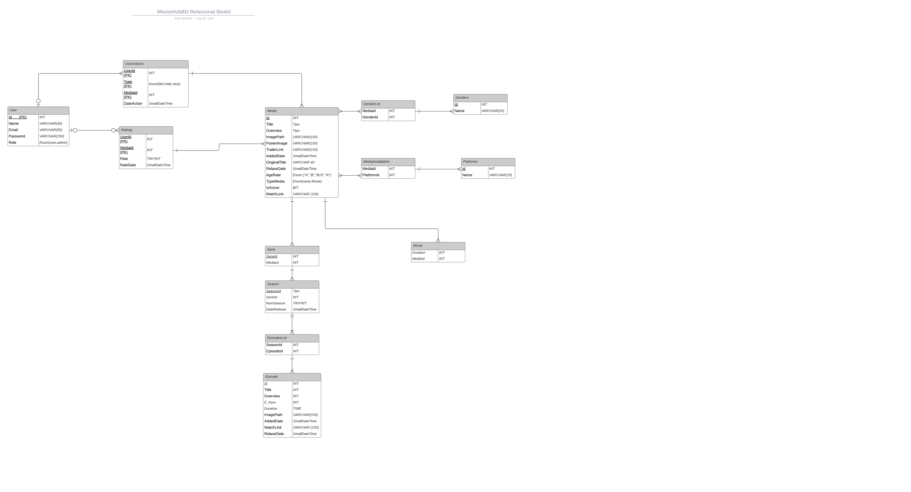
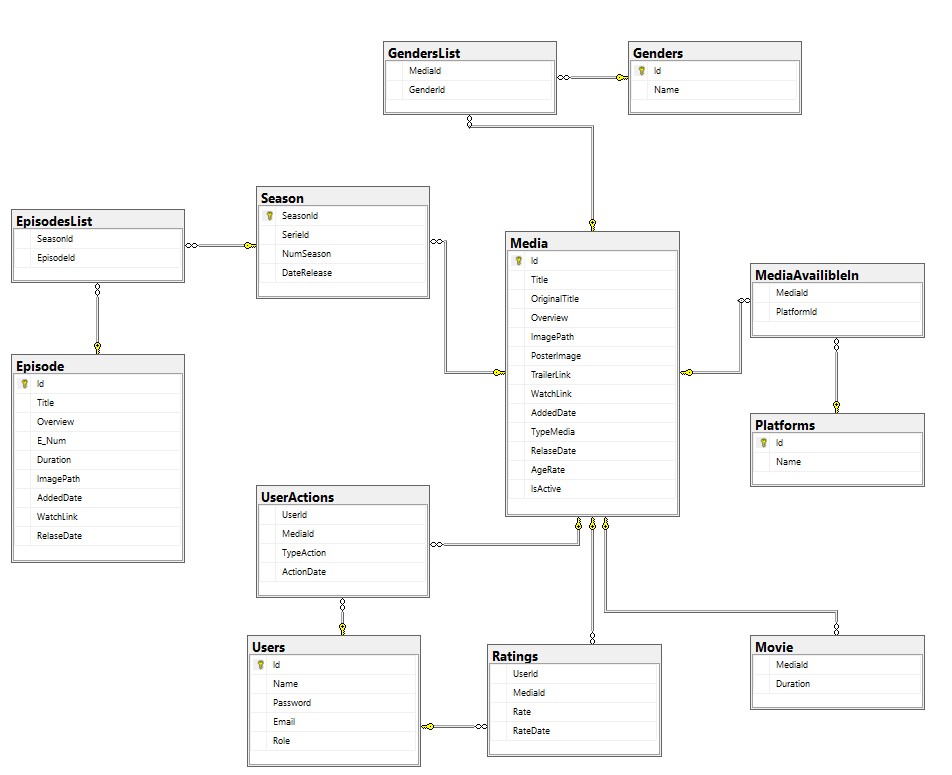

# Express.js Application

This is an Express.js application that provides several endpoints for managing files, users, series, and movies. It also provides an endpoint for retrieving trending movies to use in MovieHub Angular project.

## Table of Contents
- [Libraries Used](#libraries-used)
- [Installation](#installation)
- [Usage](#usage)
- [Routes](#routes)
  - [Files Routes](#files-routes)
  - [Users Routes](#users-routes)
  - [Series Routes](#series-routes)
  - [Movies Routes](#movies-routes)
  - [Trending Movies Route](#trending-movies-route)
- [Contributing](#contributing)
- [License](#license)

### Node

To run this project, you will need to have Node.js installed. Node.js is a JavaScript runtime built on Chrome's V8 JavaScript engine. It allows you to run JavaScript on the server side and is essential for the Angular development environment.

### Node.js Version

The recommended Node.js version for this project is:

- **Node.js 20.13.1** or higher

You can download the latest version of Node.js from the [official Node.js website](https://nodejs.org/).

To check your current Node.js version, you can run the following command in your terminal:

```bash
node -v
```
## Libraries Used

### Express.js

[Express.js](https://expressjs.com/) is a minimal and flexible Node.js web application framework that provides a robust set of features for web and mobile applications. It simplifies the development process of building a server and handling routes, requests, and responses.

### Multer.js

[Multer.js](https://github.com/expressjs/multer) is a Node.js middleware for handling `multipart/form-data`, which is primarily used for uploading files. It makes the process of handling file uploads in Express applications simple and straightforward by providing an easy-to-use API.


## Installation

1. Clone the repository:
    ```bash
    git clone https://github.com/EderGodinez/MovieHub_Back_Express.git
    ```

2. Change to the project directory:
    ```bash
    cd yourrepository/MovieHub
    ```

3. Install the dependencies:
    ```bash
    npm install
    ```

4. Create a `.env` file in the root of the project and add your environment variables following the `.env.template`
    ```dotenv
    PORT="Port number"
    DB_USER="User to database"
    DB_PASSWORD="Password to database"
    DB_DATABASE="Database name"
    DB_SERVER="Server name"
    ```

## Usage

1. Start the server:
    ```bash
    npm start
    ```

2. The server will be running on `http://localhost:3000`.

## Database




## Routes

### Files Routes

- `GET /files/:id`
  - Description: Get a file by ID.
  - Request: None.
  - Response: File data.

- `POST /files`
  - Description: Upload a single file.
  - Request: `multipart/form-data` with a file in the `file` field.
  - Response: JSON message indicating success or failure.

- `DELETE /files/:id`
  - Description: Delete a file by ID.
  - Request: None.
  - Response: JSON message
### Users Routes

- `POST /users`
  - Description: Create a new user.
  - Request: JSON body with user details.
  - Response: JSON message indicating success or failure.

- `GET /users/:id`
  - Description: Get a user by ID.
  - Request: None.
  - Response: User data.

- `PUT /users/:id`
  - Description: Update a user by ID.
  - Request: JSON body with user details.
  - Response: JSON message indicating success or failure.

- `DELETE /users/:id`
  - Description: Delete a user by ID.
  - Request: None.
  - Response: JSON message indicating success or failure.

### Series Routes

- `POST /series`
  - Description: Create a new series.
  - Request: JSON body with series details.
  - Response: JSON message indicating success or failure.
  
- `GET /series`
  - Description: Get all series.
  - Request: None.
  - Response: Array of Series.

- `GET /series/:id`
  - Description: Get a series by ID.
  - Request: None.
  - Response: Series data.

- `PUT /series/:id`
  - Description: Update a series by ID.
  - Request: JSON body with series details.
  - Response: JSON message indicating success or failure.

- `DELETE /series/:id`
  - Description: Delete a series by ID.
  - Request: None.
  - Response: JSON message indicating success or failure.
  
- `POST /series/episode`
  - Description: Create a new episode.
  - Request: JSON body with episode details.
  - Response: JSON message indicating success or failure.

- `DELETE /series/episode/:id`
  - Description: Delete an episode by ID.
  - Request: None.
  - Response: JSON message indicating success or failure.

- `PATCH /series/episode/:id`
  - Description: Update an episode by ID.
  - Request: JSON body with episode details.
  - Response: JSON message indicating success or failure.
 

### Movies Routes

- `POST /movies`
  - Description: Create a new movie.
  - Request: JSON body with movie details.
  - Response: JSON message indicating success or failure.

- `GET /movies/:id`
  - Description: Get a movie by ID.
  - Request: None.
  - Response: Movie data.

- `PUT /movies/:id`
  - Description: Update a movie by ID.
  - Request: JSON body with movie details.
  - Response: JSON message indicating success or failure.

- `DELETE /movies/:id`
  - Description: Delete a movie by ID.
  - Request: None.
  - Response: JSON message indicating success or failure.

### Trending Movies Route

- `GET /trending`
  - Description: Get the list of trending movies.
  - Request: None.
  - Response: Array of trending movies data.
## Table Sprint Review

| What was done well? | What can I do differently? | What didn't go well? |
----------------------------------|----------------------------|-----------------------
| Learn new tools that SQL Server provides us, in addition to relearning what the use of ExpressJS and the creation of database diagrams is. | Work a little more efficiently besides I could have avoided creating some view of the db to improve db performance | I couldn't found some idea to implement or to create a view in my database also I couldn't implement authentication with middlewares in routes  |


## Contributing

1. Fork the repository.
2. Create your feature branch (`git checkout -b feature/your-feature`).
3. Commit your changes (`git commit -am 'Add some feature'`).
4. Push to the branch (`git push origin feature/your-feature`).
5. Create a new Pull Request.

## License

This project is licensed under the MIT License - see the [LICENSE](LICENSE) file for details.
